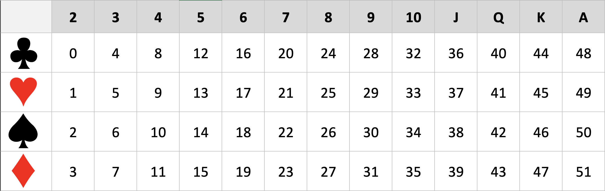
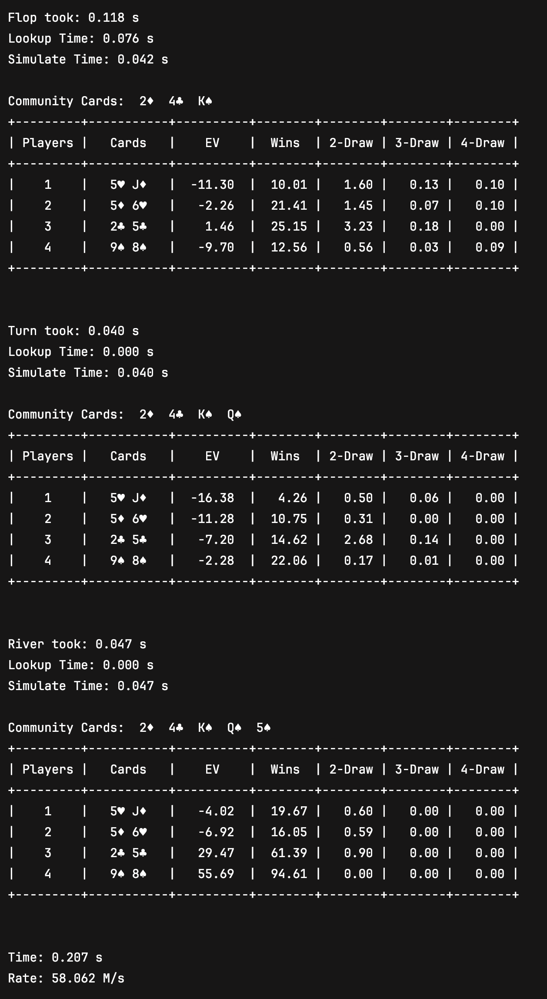
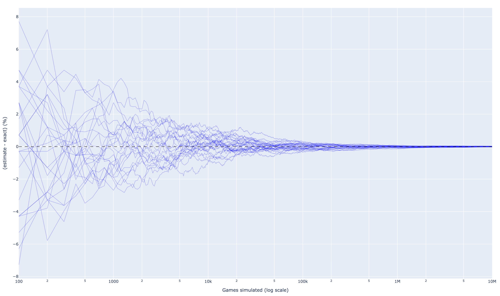

# Texas Instrument

A high-performance Texas Hold’em probability engine.

## Features

* **Player-perspective odds**  
  Probabilities are computed from each player’s perspective (each player is assumed to know their own hole cards plus the current community cards).

* **Split-pot distribution**  
  In addition to win/lose, the engine computes the probability mass of every split size (2-way, 3-way, …), enabling accurate EV calculations downstream.

* **All streets**  
  Supports **2–23 players** and computes odds/EV at **Pre-Flop, Flop, Turn, and River**.

* **Throughput**  
  Capable of simulating **~105 million games/second** (hardware-dependent), making it suitable for high-throughput workloads (e.g. AI training, real-time evaluation).

---

## Usage

### 1) Lookup table

Before you can run simulations, you must either **download** the lookup table (included in the repo) or **generate** it locally.

Generate the lookup table:

```bash
javac src/Build.java
java -cp src Build
```

This produces a **6.89 GB** binary file containing a lookup entry for every possible set of **5 community cards**. Each entry stores the relative hand strength obtained by combining that board with every possible pair of hole cards.

---

### 2) Main interface

Once the lookup table is present, use `simulate(...)` as the primary interface:

```java
double[][] odds = simulate(
    street,
    game_count,
    player_count,
    community_cards,
    player_cards
);
```

#### Parameters

**`street`** — `int`  
Stage of the hand:

* `0` → Pre-Flop  
* `3` → Flop  
* `4` → Turn  
* `5` → River  

**`game_count`** — `int`  
Number of hands to simulate for each player passed in `player_cards`.

**`player_count`** — `int`  
Total number of players seated in the hand (2–23). This may be larger than `player_cards.length` if you are computing odds for a subset of players.

**`community_cards`** — `int[5]`  
A fixed-length array of 5 integers representing the board. For streets earlier than river, only the first `street` cards are considered.

* Pre-Flop: uses 0 cards  
* Flop: uses first 3 cards  
* Turn: uses first 4 cards  
* River: uses first 5 cards  

**`player_cards`** — `int[n][2]`  
Hole cards for the players whose odds you want computed. This may be one player, all players, or any subset of players for whom hole cards are known.

All cards should be expressed as integers in the range `0–51`. The mapping below shows how cards are encoded internally.



---

### 3) Results

Example output for a 4-player hand, showing street-by-street equity updates and full split-pot distributions:



---

### 4) Validation

The plot below shows the signed error (estimate − exact) as a function of the number of simulated games. Each curve corresponds to an independent Monte Carlo run; the x-axis is logarithmic.



---

Made by **Jacob Gubernat**
